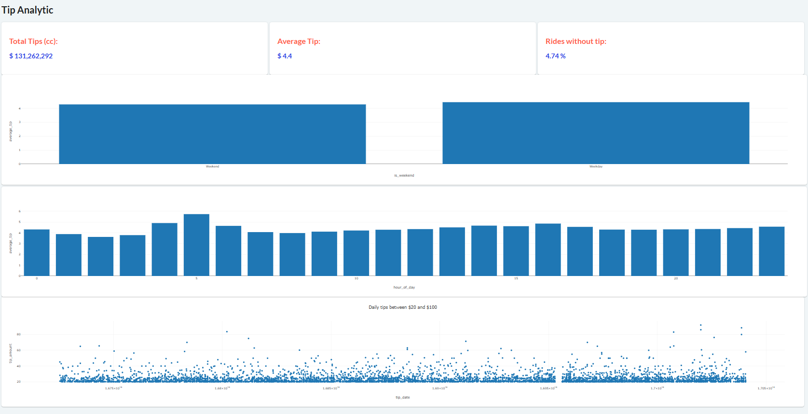
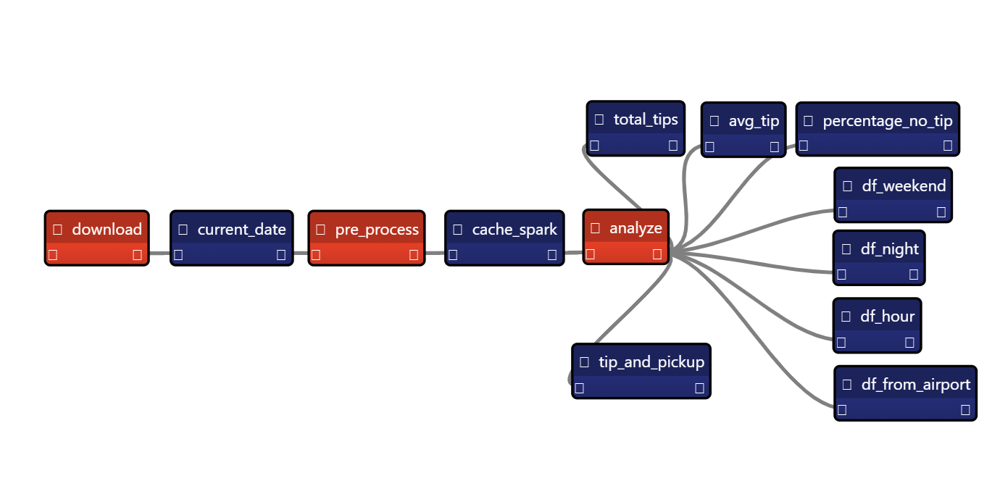

# Chapter 13

## NYC taxi application

We code a small NYC trip data application. The goal is to use distributed computing tools like Dask and Spark. The application's GUI looks like this:

Here's the pipeline we code, with a pre-processing step, and several analytical processing steps:

## Data Sources

The NYC trip data application uses data from [NYC's taxi and limousine commission (TLC)](https://www.nyc.gov/site/tlc/about/tlc-trip-record-data.page).

