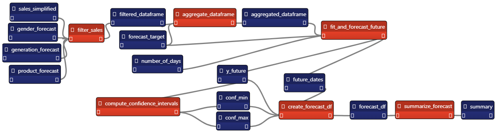

# Chapter 7: Developing a Sales Forecast App

## How it Works

### Input

First, you need to create the `parquet` files for the application. The `pre_process` directory has a notebook that simulates a pipeline that creates the files. **You'll need to create the PostgreSQL database (see the "Data for the App" section) if you want this to work! - But you can use the parquet files from the parquet_files directory if you don't want to reproduce this preliminary step.**

The application is in the `src` directory. you need to place all the parquet files in the `data` directory (if you run the `select_data.ipynb` notebook mentioned above, it stores the data in there, if not, you can copy them from `pre_process/parquet_files` into `src/data`).

### Historical Sales Dashboard

This sales dashboard show all the historical sales and breaks the data by several analytical axis:

* For the customer dimension: gender, generation.
* For the product dimension: type (of bike), color, style.
* For the time dimension: by day of the week, and by date (chronological scatterplot).

### Sales Forecast

The sales forecast application leverages the [SKTime library](https://www.sktime.net/). 

The pipeline starts by selecting a subset of the data, based on user input from the GUI (customer gender, generation, or bike type).

Then, it creates a model and fits it. The prediction frame also comes from user input, it has to be a value between 1 and 365.

**The model we used for the example is [ExponentialSmoothing](https://www.sktime.net/en/latest/api_reference/auto_generated/sktime.forecasting.exp_smoothing.ExponentialSmoothing.html), we give it a yearly (365 days) multiplicative seasonality.**

The pipeline returns a pandas DataFrame with the forecast values, as well as upper and lower confidence intervals. 

Here is how the pipeline looks:

Here is how the app looks:

## Data for the App

This application intends to replicate an enterprise situation, with data stored in a Data Warehouse. The app's data comes from [this GitHub repository](https://github.com/enarroied/AdventureWorksSimplified). 

Here is a simple representation of the schema:

You can check the [dataset's original license](https://github.com/enarroied/AdventureWorksSimplified/blob/master/LICENSE).

**Limitations:**

* Enterprise data is hardly ever this clean and complete.
* Enterprise data is not always as ideally modelled.
* This case study did not go into complex buisoness rules.

