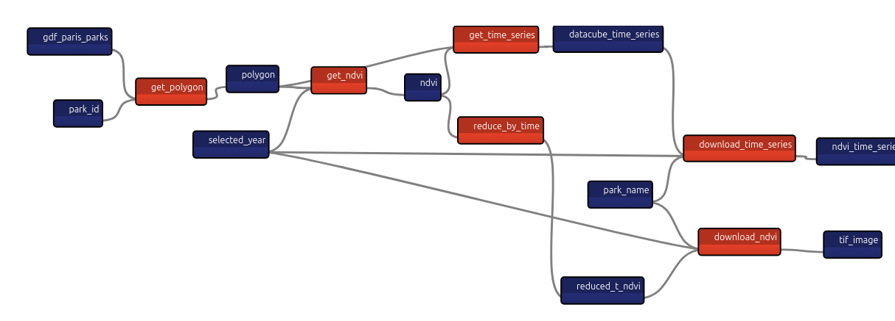
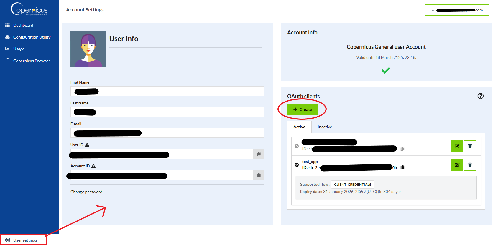

# Chapter 9

In this chapter, we create an app calculates NDVI for Paris' parks, using open data from the city of Paris and the European Space Agency's satellite images (Sentinel-2 data). 

## Scenario's pipeline

## Create an account on Copernicus' website

For our app, we'll be using Sentinel-2 data, from the European Space Agency (ESA).

**You need to create an account: https://dataspace.copernicus.eu/**.

After you create an account, you need to get the client ID and secret to authenticate your API requests, from your account settings:

