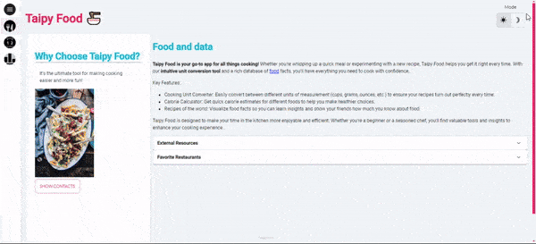

# Chapter 2: Creating User Interfaces with Taipy

- [Chapter 2: Creating User Interfaces with Taipy](#chapter-2-creating-user-interfaces-with-taipy)
  - [Repo Structure](#repo-structure)
  - [Extra content](#extra-content)
    - [Change themes with a toggle button](#change-themes-with-a-toggle-button)
    - [Adding custom CSS files](#adding-custom-css-files)

## Repo Structure

In this chapter, we coded a mock-up Taipy Gui application. Each of the directories represents a main step in the building process:

- Part 1: A single page app, with static content.
- Part 2: Multiple page app, we added a unit convertor, to show how callbacks work.
- Part 3: the final application.

The `taipy_controls` directory has a table that summarizes Taipy visual elements.



## Extra content

### Change themes with a toggle button

Taipy has two themes: dark and light, which you can choose using the `run()` method (with the dark_mode Boolean parameter). You can also add a toggle button to let users switch themes, anywhere on the root page:

```python
tgb.toggle(theme=True)
```

### Adding custom CSS files

If the Stylekit options aren't enough to customize your application, you can add custom CSS files to your application. For example, in the `welcome.py` page, "Food and data" lacks the `color-secondary` because it comes from a file that Taipy's Stylekit can't customize. Adding a custom CSS file works alongside using the Stylekit! Also, if you need a new font, you’ll need to import it with a CSS file.

Place your custom files in a directory named CSS. We'll add a file called main.css. To include this CSS file, use the GUI element and specify the file path:

```python
taipy_food_gui = Gui(pages=taipy_food_pages, css_file="./css/main.css")
```

Let's add some code to our CSS file. Let's start by adding a new font, using `@import`,as well as a color for `<h2>` tags. This way, our "Food and data" title will have the same color as other headers, [here is the code](https://github.com/PacktPublishing/Getting-Started-with-Taipy/blob/main/chapter_02/3-final_app/css/main.css)

We can also reduce the size of the table rows and the font in the table, and add separation lines, for better visibility ([check the code here](https://github.com/PacktPublishing/Getting-Started-with-Taipy/blob/main/chapter_02/3-final_app/css/table.css)).
