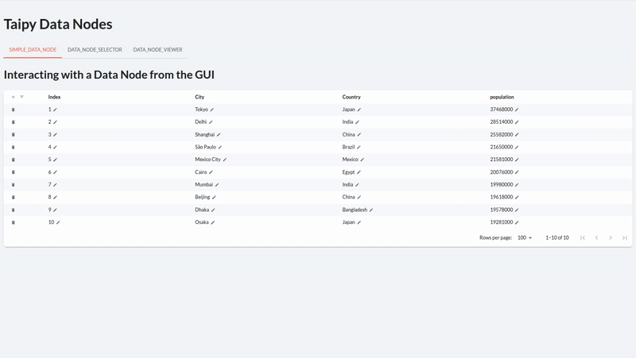

# Chapter 3: Connecting to Data Sources with Data Nodes

- [Chapter 3: Connecting to Data Sources with Data Nodes](#chapter-3-connecting-to-data-sources-with-data-nodes)
  - [Warning](#warning)
  - [Repo Structure](#repo-structure)
  - [Data Node visual elements](#data-node-visual-elements)
  - [Data sources](#data-sources)
    - [Image](#image)
    - [Tabular data](#tabular-data)

## Warning

When you use Taipy's `Orchestrator` class, it create a `.taipy` directory, with cached information about your Taipy Scenario objects (such as Data Nodes). When you run different programs that create Data Nodes of different types from within the same directory (such as `1-data_node_examples`), you may encounter issues. **Deleting the `.taipy` folder sometimes fixes those issues**.

## Repo Structure

The repo contains the following directories:

- `1-data_node_examples`: contains files with configurations of different types of Data Nodes, along with instantiation. Some Data Nodes require specific data sources (such as database connections).
- `2-data_node_visual_elements`: contains a Taipy app with Data Node visual elements, so you can see how they look (the app doesn't serve any other purpose than showing each indivisual element).

## Data Node visual elements

This chapter presents Data Node visual elements. We don't dive into them, but you can see how they look before we integrate them with Scenario Management.

## Data sources

### Image

The [image of Tokyo](https://eoimages.gsfc.nasa.gov/images/imagerecords/89000/89177/tokyo_tmo_2016330_th.jpg) comes from Nasa's Earth Data.

### Tabular data

Most tabular data comes [from wikipedia](https://en.wikipedia.org/wiki/List_of_largest_cities).
