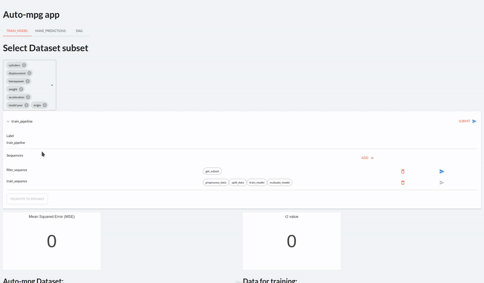

# Chapter 4: Orchestrating Taipy Applications

- [Chapter 4: Orchestrating Taipy Applications](#chapter-4-orchestrating-taipy-applications)
  - [Repo Structure](#repo-structure)
  - [Dataset](#dataset)

## Repo Structure

This chapter explores Scenario Management. The repo has the following directories:

- The `minimal_pipeline` directory has a Scenario that prints `"I'm super minimal!"`.
- The `select_subset` directory goes one step further and filters a pandas DataFrame.
- The `visual_elements` directory is an intermediate step for the final Auto-MPG app. 
- The `auto_mpg` directory has the final AutoMPG add, that trains a regression model and lets users look for predictions with that model.

## Dataset

The data for this application is the classic machine learning dataset [Auto MPG](https://archive.ics.uci.edu/dataset/9/auto+mpg).

To make it easier to work with it, we download a [CSV version of the dataset from Kaggle](https://www.kaggle.com/datasets/uciml/autompg-dataset).
