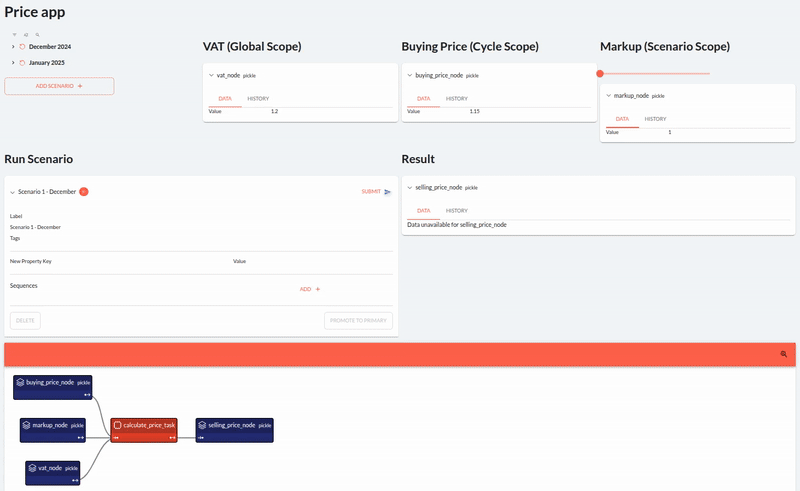
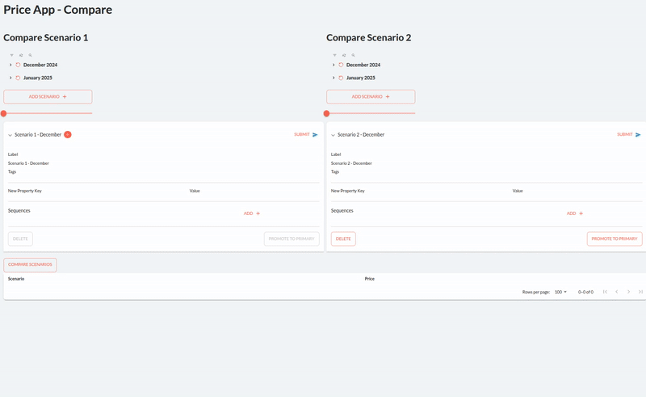

# Chapter 5

This chapter explores Scenario Management and Scenario comparison from a functional perspective. We create two small applications: A prices app, that shows the difference between Data Node Scopes, and a comparison app, that shows how to do basic Scenario comparison. 

## Prices app

This is how the app looks:

## Comparison app

This is how the app looks:

