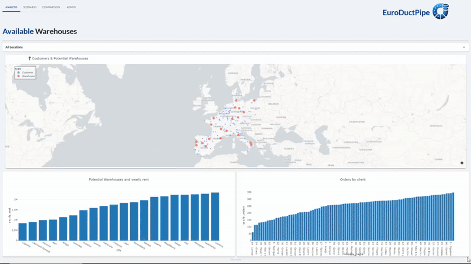

# Chapter 8

This chapter covers the creation of an optimization app. This app allows users to visualize candidate warehouse and customer locations, so they can select the best warehouses to reduce supply cost and CO2e emissions.

The app has 4 tabs: 

* `Analysis` : Shows the raw data
* `Scenario`: Allows users to select parameters for the optimization Scenario, run it and see the results
* `Comparison`: Allows users to compare two Scenarios, next to each other
* `Admin`: Shows all the application's Scenario elements

## Application overview

## Scenario pipeline

Here is how the Scenario's pipeline looks:

## Data

To create our datasets, we asked Chat GPT to generate some JSON structures, with European cities and coordinates. We also added some random amounts for the operation costs and facility CO2e emissions, and we used `faker` to create the company names. You can find the notebook to create the data in [create_data.ipynb](create_data.ipynb), and the datasets in [the app's data directory](./src/data). Also note that you can generate new versions of the dataset to play around with the app and get different results. 

### Dataset descriptions

#### customers.csv

* `id`: Unique identifier
* `country`: Customer's country
* `city`: Customer's city
* `latitude`: Geographical information, for plotting and to calculate distances
* `longitude`: Geographical information, for plotting and to calculate distances
* `company_name`: Generated with `faker`, we concatenate the `id` number to avoid visualization problems in case of repeated names
* `yearly_orders`: How many trucks filled with pipes EuroDuctPipes sends to the customer each year

**Example rows:**

| id  | country | city        | latitude | longitude | company_name                    | yearly_orders |
| --- | ------- | ----------- | -------- | --------- | ------------------------------- | ------------- |
| 64  | Italy   | Bologna     | 44.4949  | 11.3426   | 64 - Lombardo-Martinelli SPA    | 60            |
| 21  | Spain   | Guadalajara | 40.6292  | -3.1614   | 21 - Vázquez & Asociados S.Com. | 113           |

#### warehouses.csv

* `warehouse`: Unique warehouse identifier
* `country`: Warehouse's country
* `city`: Warehouse's city
* `latitude`: Geographical information, for plotting and to calculate distances
* `longitude`: Geographical information, for plotting and to calculate distances
* `yearly_costs`: How much it costs to operate the warehouse yearly (rend, wages, bills...)
* `yearly_co2_tons`: Carbon emissions per year, expressed as CO2e, in metric tons

**Example rows:**

| warehouse    | country | city             | latitude | longitude | yearly_cost | yearly_co2_tons |
| ------------ | ------- | ---------------- | -------- | --------- | ----------- | --------------- |
| Warehouse 3  | Spain   | Logroño          | 42.4627  | -2.4444   | 850071      | 441             |
| Warehouse 10 | France  | Clermont-Ferrand | 45.7772  | 3.087     | 901430      | 568             |