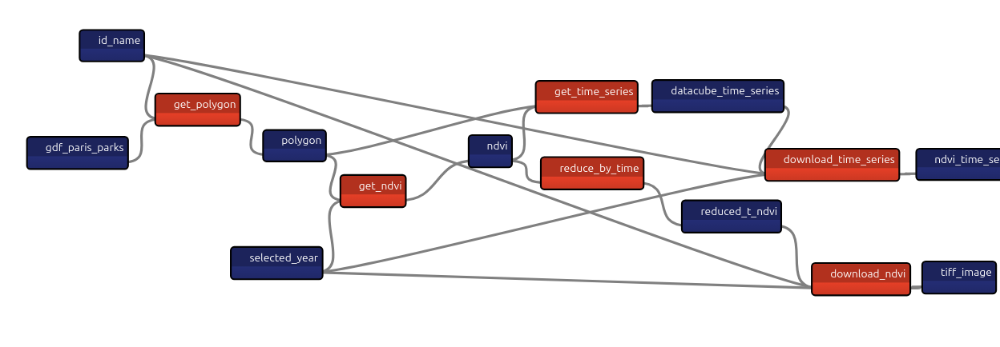
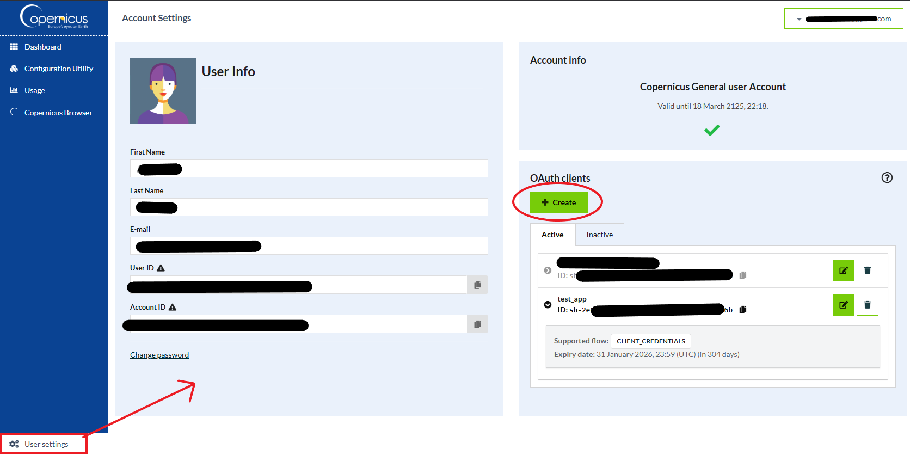

# Chapter 9: Taipy for Logistics: Creating Supply Chain Management Apps

- [Chapter 9: Taipy for Logistics: Creating Supply Chain Management Apps](#chapter-9-taipy-for-logistics-creating-supply-chain-management-apps)
  - [Notebook For Help](#notebook-for-help)
  - [Scenario's pipeline](#scenarios-pipeline)
  - [Create an account on Copernicus' website](#create-an-account-on-copernicus-website)

In this chapter, we create an app calculates NDVI for Paris' parks, using open data from the city of Paris and the European Space Agency's satellite images (Sentinel-2 data).

## Notebook For Help

To help you understand the algorithms we used in the app, we also created a [demonstration notebook](./how_to_help/open_paris_data.ipynb). This shows how we read the data, create the main charts, and process the data with OpenEO to retrieve time series and NDVI matrices with average data (and how to plot these as well).

## Scenario's pipeline

## Create an account on Copernicus' website

For our app, we'll be using Sentinel-2 data, from the European Space Agency (ESA).

**You need to create an account in [Copernicus website](https://dataspace.copernicus.eu/**).

After you create an account, you need to get the client ID and secret to authenticate your API requests, from your account settings:

