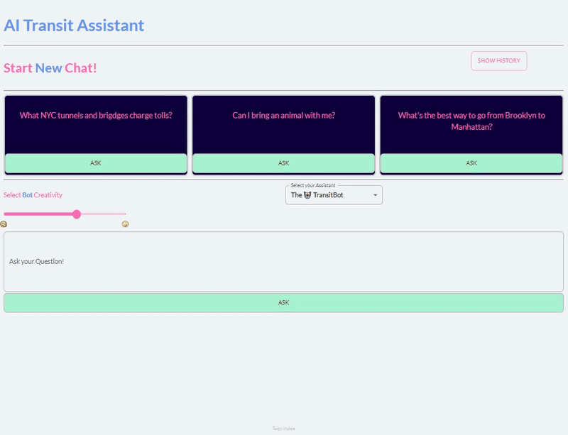

# Chapter 10

- [Chapter 10](#chapter-10)
  - [Repo Structure](#repo-structure)
  - [Main Application](#main-application)
  - [API Keys](#api-keys)

## Repo Structure

The repo has the following directories:

- `how_to_help` : Has a notebook called `mistral_ai_langchain.ipynb`, so you can test your API keys and how the models work using LangChain.
- `chat_element` : a mini-app that shows how Taipy's `chat` visual element work
- `ai_wrapper` : This a minimal app that uses Taipy's `chat` element to interact with an LLM, a basic LLM wrapper.
- `transibot_1`, `transibot_2`, `transibot_3`: the book explains how to build the app incrementally. `transibot_3` has the final version, the other two directories contain intermediate steps.

## Main Application

In this chapter, we create an LLM chat application with Taipy. We cvall this app "The Transibot", a chatbot that gives information about NYC transit

This is how the application looks:



## API Keys

Once you get your API key from Mistral, you could pass it to the `ChatMistalAI`  object like this (we don't recommend it, but you can):

```python
chat_bot = ChatMistralAI(
        model="model_name", # default: "mistral-small"
        mistral_api_key = "Your-API-Key"
    )
```

To securely authenticate with Mistral, we recommend **setting your API key as an environment variable** instead of hardcoding it into your code. As long as the name of your environment variable is `MISTRAL_API_KEY`, the `ChatMistralAI` object will be able to detect it.

For Linux or macOS systems, you can export:

```bash
export MISTRAL_API_KEY="your-actual-api-key"
source ~/.bashrc 
```

If you use windows, you can do:

```powershell
setx MISTRAL_API_KEY="your-actual-api-key"
```

Then you do not need to change the code. The library will automatically detect and use it:

```python
chat_bot = ChatMistralAI(model=chat_name)
```
