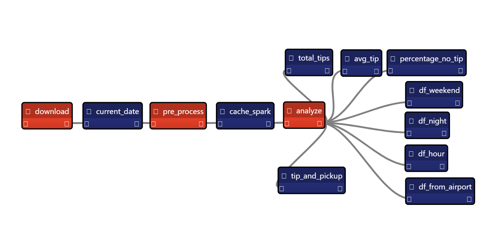

# Chapter 12: Handling Large Data in Taipy Application

- [Chapter 12: Handling Large Data in Taipy Application](#chapter-12-handling-large-data-in-taipy-application)
  - [NYC taxi application](#nyc-taxi-application)
  - [Data Sources](#data-sources)
  - [Help for Setup](#help-for-setup)

## NYC taxi application

We code a small NYC trip data application. The goal is to use distributed computing tools like Dask and Spark. The application's GUI looks like this:

Here's the pipeline we code, with a pre-processing step, and several analytical processing steps:

## Data Sources

The NYC trip data application uses data from [NYC's taxi and limousine commission (TLC)](https://www.nyc.gov/site/tlc/about/tlc-trip-record-data.page).

## Help for Setup

To follow the chapter, you'll need to use Spark and and AWS S3. If you're unfamiliar with it, we created [a small help document](./how_to_help/README.md).
