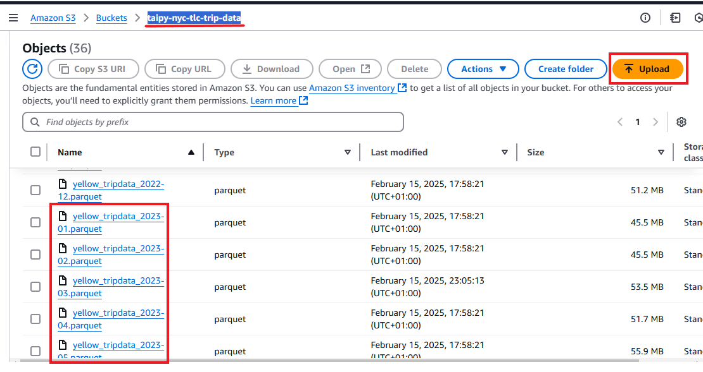
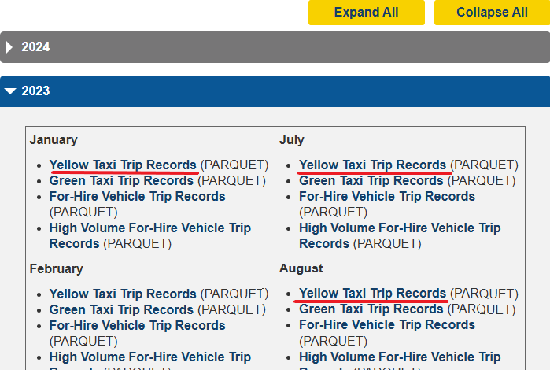
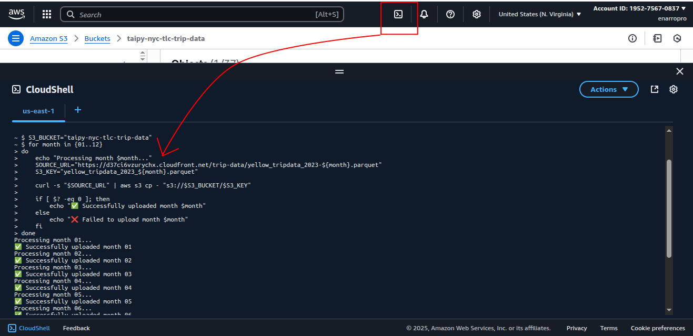
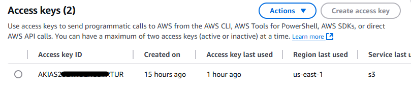

# Help for Chapter 12

This chapter talks about how to use Taipy with tools such as Spark or AWS S3 buckets for cloud storage. These technologies are important for data specialists, but they require technical skills that are beyond the scope of this book.

This section aims to help you install and use the tools we use in the chapter. It's not a comprehensive tutorial but a focused guide to help you install, configure, and use the specific tools needed to follow along with the examples in this chapter.

- [Help for Chapter 12](#help-for-chapter-12)
  - [Setting up Spark](#setting-up-spark)
    - [Installation Considerations](#installation-considerations)
      - [Java Version and Dependencies](#java-version-and-dependencies)
      - [Installing Spark](#installing-spark)
    - [Useful Links](#useful-links)
  - [Downloading Data from TLC](#downloading-data-from-tlc)
  - [Setting AWS S3 Bucket](#setting-aws-s3-bucket)
  - [Retriveing Data to AWS S3 Bucket](#retriveing-data-to-aws-s3-bucket)
    - [Manual Version (easiest)](#manual-version-easiest)
    - [From CLI](#from-cli)
  - [Using Data from S3 Bucket](#using-data-from-s3-bucket)

## Setting up Spark

Apache Spark is an open-source, distributed computing system used for big data processing and analytics. Setting it up can be tricky, here are some tips and common pain points to help you install it.

### Installation Considerations

#### Java Version and Dependencies

Spark requires the Java Development Kit (JDK) to run. Spark is written in Scala, which operates on the Java Virtual Machine (JVM). **A Java installation is a fundamental prerequisite for Spark to operate**.

You'll find many tutorials online on how to install Spark, but they can be outdated or skip important warnings. Here are some important things to consider:

- **Spark doesn't officially run on Windows**. That doesn't mean you can't use Spark on a Windows computer, it just means you need to use a supported environment like the Windows Subsystem for Linux (WSL), which is built into Windows 10 and 11.

- Spark runs on Linux and macOS. If you're a Windows user, you'll need to use WSL or a similar virtualization tool.

- Spark needs a specific version of Java! **A common pain point is making sure Spark is configured to use the correct JDK version**. This involves not only installing the right version but also ensuring that Spark is pointed to it, especially if you have several Java versions installed on your system.

**Not all versions of Spark work with the same versions of Java**. In the book, we used Spark 3.2.0, which works with Java 8/11. But more recent versions of Spark may require more recent versions of Java... Read the specs for your particular version!

#### Installing Spark

The simplest and most reliable way to use Spark is on a Linux-based system. **Installing Spark on Windows is not officially supported and is prone to issues**. It's strongly recommended to avoid this approach. For Mac users, the process is generally more straightforward.

The recommended approaches are:

- **Linux System**: Using a dedicated Linux machine (like Ubuntu, Fedora, Arch...) is the easiest way, but most people don't use Linux, if that's your case, keep reading :).

- **Windows Subsystem for Linux (WSL)**: This is the easiest option for Windows users. It allows you to run a full Linux environment directly on Windows. If you use a common distribution, such as Ubuntu, to run on WSL, you'll find plenty of tutorials.

- **🥇 Docker (best option for testing)**: Docker containers provide an isolated environment, making it an excellent choice for testing and development. **On Windows, Docker Desktop uses WSL 2 under the hood**, so you'll be leveraging the same Linux environment for your Spark container. This is a reliable option.

### Useful Links

- [Official Spark docs](https://spark.apache.org/docs/latest/)
- [A concise tutorial to install Spark, version 3.4.0, in Ubuntu and CentOS](https://www.virtono.com/community/tutorial-how-to/how-to-install-apache-spark-on-ubuntu-22-04-and-centos/) (note that you can use this tutorial to install it on WSL)
- [Apache Spark - Docker Image](https://hub.docker.com/r/apache/spark/)

## Downloading Data from TLC

You can download the files one by one, by clicking on all the links, or better, create a Python loop to retrive all the files ([check this notebook to launch it](./download_tlc_data.ipynb)). Anyhow, here's the loop:

```python
import requests
import shutil

for month in range (1, 13):
    str_month = str.zfill(str(month), 2)
    page = f"https://d37ci6vzurychx.cloudfront.net/trip-data/yellow_tripdata_2023-{str_month}.parquet"
    filename = f"yellow_tripdata_2023_{str_month}.parquet"
    with requests.get(page, stream=True) as r:
        with open(filename, 'wb') as f:
            # Use shutil to efficiently write the content to the file
            shutil.copyfileobj(r.raw, f)
    print(f"Done: {month}/12")
```



## Setting AWS S3 Bucket

AWS S3 is a highly scalable, durable, and secure object storage service for storing and retrieving any type of data. To use this service, you need to create an AWS account and an S3 bucket (a "storage unit"). The use we cover in this book fits in AWS' free tier. To create an S3 bucket:

1. Go to [AWS](https://aws.amazon.com/) and click "Create an AWS Account."
2. Follow the instructions to create an account.
3. Search for "S3" in the services search bar and select it.
4. Click on "Create bucket".
5. Choose a name for your storage. In our case, we named it `taipy-nyc-tlc-trip-data`.

Now that you've set your storage, you can add all the files to it.

## Retriveing Data to AWS S3 Bucket

To follow the chapter, you'll need to retrieve data from [NYC TLC Trip Record Data](https://www.nyc.gov/site/tlc/about/tlc-trip-record-data.page), in particular the 12 files from 2023.



### Manual Version (easiest)

You can download all twelve files for 2023 (look at the "Downloading Data from TLC" section), and then upload them to the S3 bucket.

Once you have all your files in a folder, go to your bucket (defined in the previous step) and click "Upload" to add your Parquet files. This can take some time.

And that's it!

### From CLI

This would be the recommended option, but since the chapter starts using the files locally, you can do it either way.

If you wanted to retrieve the files one by one, you could use the following `curl` command:

```bash
curl "https://d37ci6vzurychx.cloudfront.net/trip-data/yellow_tripdata_2023-01.parquet" | aws s3 cp - s3://taipy-nyc-tlc-trip-data/yellow_tripdata_2023-01.parquet
```

But there's an event better option: tlo create a small bash script to retrieve all 12 files at once:

```bash
S3_BUCKET="taipy-nyc-tlc-trip-data" 
for month in {01..12}
do
    echo "Processing month $month..."
    SOURCE_URL="https://d37ci6vzurychx.cloudfront.net/trip-data/yellow_tripdata_2023-${month}.parquet"
    S3_KEY="yellow_tripdata_2023_${month}.parquet"
    
    curl -s "$SOURCE_URL" | aws s3 cp - "s3://$S3_BUCKET/$S3_KEY"
    
    if [ $? -eq 0 ]; then
        echo "✅ Successfully uploaded month $month"
    else
        echo "❌ Failed to upload month $month"
    fi
done
```



## Using Data from S3 Bucket

When we have the bucket created, we need to create a security key. To do that, you need to:

- Open the IAM Console: In the AWS Management Console, use the search bar at the top, type IAM, and click on IAM under Services.
- It's highly recommended to create a specific user and add it to a group ([more information here](https://aws.amazon.com/iam/)).
- Go to the Security credentials tab, scroll down to the Access keys section, and create a new pair of access keys and secret keys (you'll only be able to see the secret key once, so don't lose it!)
.

Once you have your keys, the best practice is to set environment variables for them. This approach enhances security by preventing sensitive credentials from being hard-coded in your scripts or applications, while also improving portability by allowing you to manage and switch keys across different environments. Here's how to create them: 

- On Windows, open your CMD and type `setx AWS_ACCESS_KEY_ID "your-access-key-id"` (do the same for `AWS_SECRET_ACCESS_KEY`).

* On Mac and Linux, do: `echo 'export AWS_ACCESS_KEY_ID="your-access-key-id"' >> ~/.bashrc` (do the same for `AWS_SECRET_ACCESS_KEY`). Then do `source ~/.bashrc`.

For Windows systems, you'll need to restart your terminal or your machine for the variables to take effect.