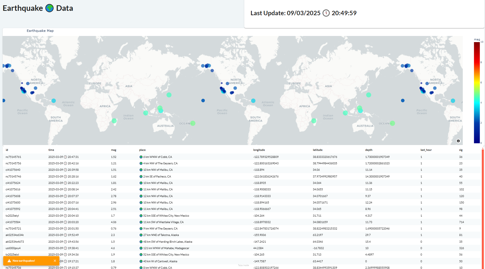
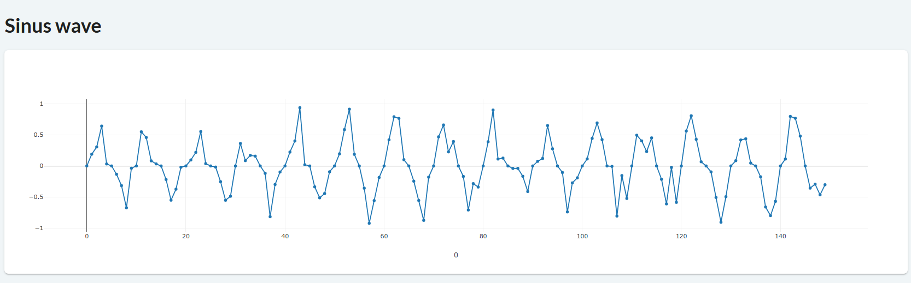

# Chapter 13: Creating Real-Time Apps with Taipy

- [Chapter 13: Creating Real-Time Apps with Taipy](#chapter-13-creating-real-time-apps-with-taipy)
  - [Earthquake App](#earthquake-app)
  - [Sinus Wave App](#sinus-wave-app)

## Earthquake App

This app polls data from the [USGS earthquake website](https://earthquake.usgs.gov).

## Sinus Wave App

This app simulates a pseudo-sinus wave signal, sent by a sender (`sender.py`) and received in real time in Taipy's app, using [websockets](https://pypi.org/project/websockets/).

