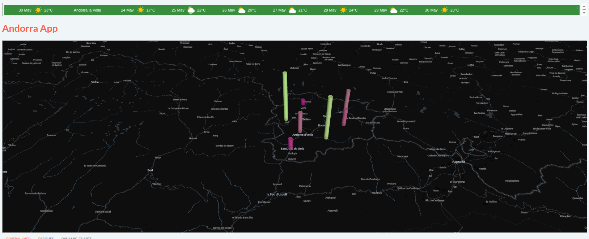

# Answer 3

**IMPORTANT**: You need to install PyDeck:

```
pip install pydeck
```

To add the PyDeck map, you can place the `pydeck_map.py` file in the `/algorithms` directory. We also provide a new `main.py` with the provider registration.

We place the map at the top of the app, hich isn't ideal: this is to not add more files to the answer, feel free to create a new page, or to add the map elewhere!

This is how the map looks:

